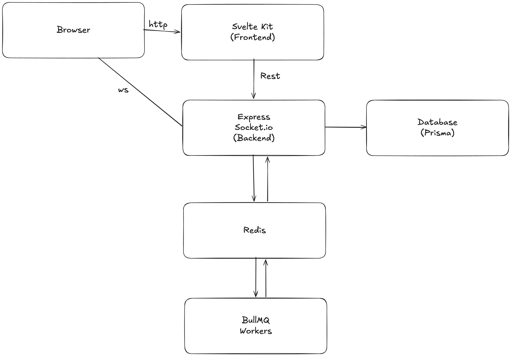
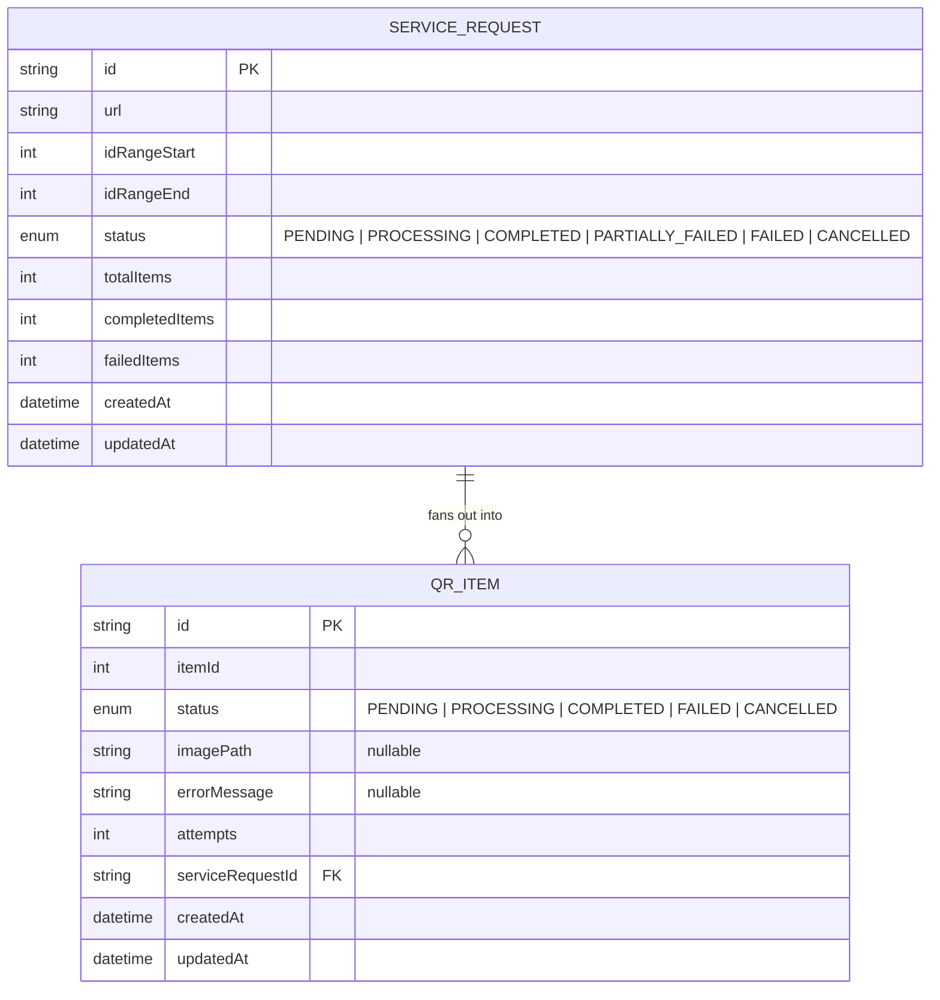

# HeavenlyQR

A real-time service request management system, applied to a QR code generation
domain: an operator submits a **URL + an ID range**, the system generates one
QR code per ID in that range as a background batch job, and supervisors watch
the batch progress live over WebSockets — no polling, no page refreshes.

Full problem statement, functional/non-functional requirements, and design
rationale: [`docs/System-Analysis.md`](docs/System-Analysis.md).

## Setup Instructions (Build and run)

### Dev (local, hot-reload, no Docker for the apps)

```bash
# 1. Postgres + Redis only — reuses the same compose file
docker compose up -d postgres redis

# 2. env files (one-time)
cp backend/.env.example backend/.env
cp frontend/.env.example frontend/.env

# 3. backend — two separate terminals (API and worker are separate processes)
cd backend
npm install
npx prisma migrate dev
npm run dev          # terminal A — API on :4000
npm run dev:worker   # terminal B — worker

# 4. frontend — third terminal
cd frontend
npm install
npm run dev           # :5173
```

Open `http://localhost:5173`.

### Production (Docker Compose — the full stack)

```bash
cp .env.example .env  
# change url or passowrd and apply other best practices 
docker compose up -d --build
```

Builds and starts: `postgres`, `redis`, `migrate` (applies schema, then
exits), `api`, `worker`, `frontend`. Open `http://localhost:5173`.

```bash
docker compose ps                 
docker compose logs -f api        # tail one service
docker compose down                # stop, keep data
docker compose down -v             # stop and wipe volumes (Postgres/Redis/storage)
docker compose up -d --build api  # rebuild + restart one service
```


### Production without Docker (bare Node, alternative)

```bash
# backend
cd backend && npm ci && npm run build
npx prisma migrate deploy
npm run start          # API
npm run start:worker   # separate process

# frontend
cd frontend && npm ci && npm run build
npm run start
```
### Environment variables

| Variable | Used by | Default | Notes |
|---|---|---|---|
| `NODE_ENV` | backend | `development` | |
| `PORT` | backend | `4000` | API listener port |
| `CORS_ORIGIN` | backend | `http://localhost:5173` | Also used for the Socket.IO CORS config |
| `DATABASE_URL` | backend | — | required |
| `REDIS_HOST` / `REDIS_PORT` / `REDIS_PASSWORD` | backend | `localhost` / `6379` / — | |
| `WORKER_CONCURRENCY` | worker | `4` | jobs processed in parallel per worker process |
| `QR_JOB_QUEUE_NAME` | backend, worker | `qr-generation` | must match between API and worker |
| `STORAGE_DIR` | backend, worker | `storage` | where generated PNGs/ZIPs live — shared volume in Docker |
| `PUBLIC_API_URL` | frontend | `http://localhost:4000` | browser-facing backend URL (fetch + Socket.IO) |
| `API_INTERNAL_URL` | frontend | falls back to `PUBLIC_API_URL` | server-side (SSR/form actions) backend URL — in Docker this is the internal service name (`http://api:4000`), since `localhost` inside the frontend container means the frontend container itself |
| `ORIGIN` | frontend | — | required by SvelteKit's `adapter-node` for CSRF-safe form actions in production — must match the public-facing URL |
| `PORT` | frontend | `3000` | adapter-node listen port |


## Architecture overview

Users can use the system via browers and REST+WS(Socket.io) apis. Backend creates and pulls data from Postgres database using Prisma ORM also sends the services requests to queue service for the workers service to pick up. Here the queue service is made of BullMQ and Redis (easy native node solution). The worker services picks up the queued requests and creates qr as per instructions then zips them, lastly updates them in database and sends update via redis pub/sub. A listener listens to redis pub/sub then forwards the updates to the users and operators.

## Technology stack 

| Layer | Choice | 
|---|---|
| Backend runtime | Node.js + TypeScript, Express |
| Database | PostgreSQL + Prisma |
| Queue / background jobs | Redis + BullMQ |
| Real-time | Socket.IO + Redis pub/sub | 
| Frontend | SvelteKit 5 (runes) | 
| UI components | Tailwind v4 + shadcn-svelte (bits-ui) |
| Validation | Zod |
| Containerization | Docker + Docker Compose |

## Assumptions

- **No authentication/authorization.** Operator vs. Supervisor is a UI-level
  distinction (what a screen shows), not an enforced permission boundary.
  Anyone with access can submit, view, and cancel any request. Explicitly
  out of scope for this submission.
- **A "QR code" encodes one URL variant per ID** the system treats the ID
  as an opaque integer combined with the base URL (`{url}/{id}`); it doesn't
  assume what the ID means to the business.
- **A request is a fixed-size batch, not an open-ended stream.** The ID
  range is capped at 5,000 IDs and fixed at creation time.
- **Single-region, single-deployment scale** — not multi-tenant SaaS.
- **Generated QR images are stored server-side** (a shared volume between
  the API and worker containers) and served back through the API, rather
  than generated client-side.


## API documentation
View OpenAPI docs: [docs/api/openapi.yml](docs/api/openapi.yml) and [docs/api/index.html](docs/api/index.html)


## WebSocket Events
Socket.io web sockets used. (Same url as the backend)
| Event | Purpose |
| --- | --- |
| `operator` | Server updates the operator of newly created service requests |
| `progress` | Server sends progress to certain request ids subscribed via sending the request id to `request:<requestid>` |


## Database setup

Schema lives in `backend/prisma/schema.prisma`. Two models:



**Applying migrations:**
```bash
# local dev
cd backend && npx prisma migrate dev

# production 
npx prisma migrate deploy
```