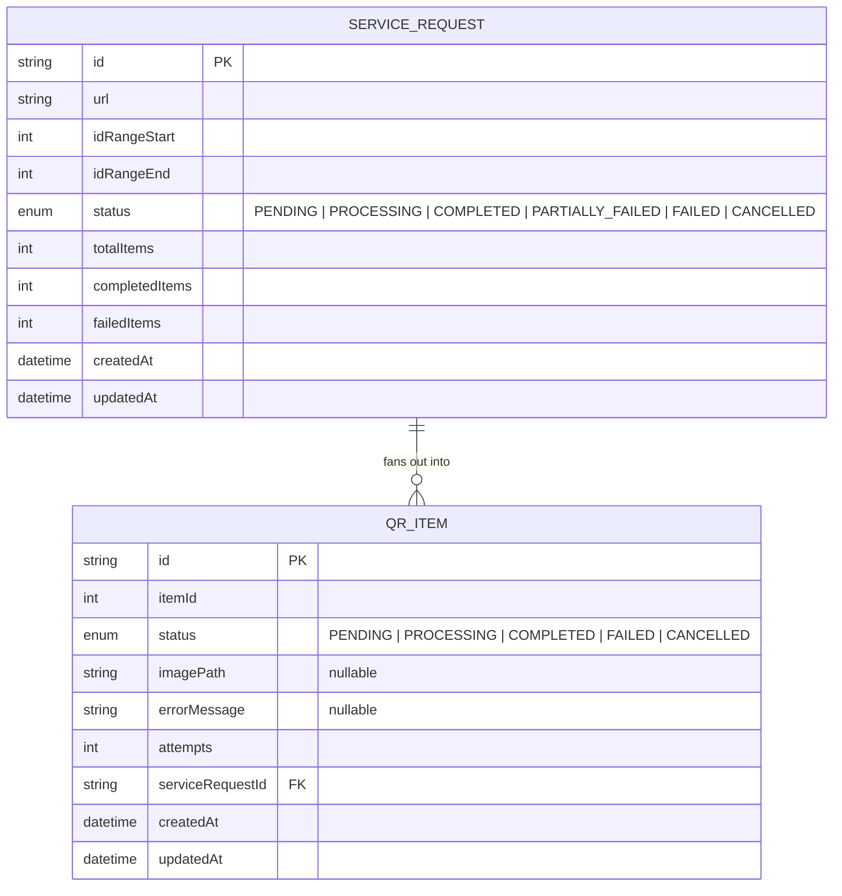

# System Design

## Architecture overview

Users can use the system via browers and REST+WS(Socket.io) apis. Backend creates and pulls data from Postgres database using Prisma ORM also sends the services requests to queue service for the workers service to pick up. Here the queue service is made of BullMQ and Redis (easy native node solution). The worker services picks up the queued requests and creates qr as per instructions then zips them, lastly updates them in database and sends update via redis pub/sub. A listener listens to redis pub/sub then forwards the updates to the operators and supervisors.

## Component Diagram
Please refer to: [Component Diagram](./Compment%20Diagram.pdf)

## Database Design (ER Diagram)

## API Design
Please refer to: [API Docs html](./api/index.html) or [OpenApi Docs](./api/openapi.yml)

## WebSocket Communicaton Flow

## Concurrency Model
Concurrency happens at three levels: across requests, within a request, and across real-time listeners.

- **Across requests (job level):** Each service request becomes one BullMQ job (`jobId = requestId`, so the same request can never be queued twice). The worker process pulls jobs off the Redis-backed queue with a configurable `WORKER_CONCURRENCY` (default 4), so up to N requests are generated in parallel. Because the queue lives in Redis and not in-process memory, more worker containers can be started (`docker compose up --scale worker=N`) to add horizontal capacity without any code change.

- **Within a request (item level):** QR items for a single request are generated **sequentially**, not in parallel (`for` loop in [qrgeneration.service.ts](../backend/src/services/qrgeneration.service.ts)). This is a deliberate trade-off: parallelism is already gained across requests, so keeping one job single-threaded avoids flooding disk I/O and Postgres with bursty writes, keeps `completedItems` progress and cancellation checks trivially race-free, and keeps ordered progress events cheap to reason about. Cancellation is checked before every item, so a `CANCELLED` request stops mid-way instead of finishing the whole batch.

- **Across real-time listeners:** Workers never talk to Socket.IO clients directly they only publish progress to a Redis pub/sub channel (`service-requests:progress`). Each API/socket server instance keeps one subscriber connection and re-broadcasts to its own connected sockets (room `request:{id}` for detail views, a global `supervisor` event for the list view). This decouples the number of workers from the number of API instances — both can scale independently, and any API replica can push an update that originated on any worker.

- **Race safety:** Node's single-threaded event loop means handlers themselves don't need locks; the real races are between the API and worker processes acting on the same row. These are resolved in Postgres, not in application memory — e.g. `qrGenerationPreProcess` uses an atomic `updateMany({ where: { status: { not: "CANCELLED" } } })` so a request cancelled right before the worker picks it up is never silently flipped back to `PROCESSING`.

## Technology stack Justification

| Layer | Choice | Justification |
|---|---|---|
| Backend runtime | Node.js + TypeScript, Express | Minimal, well known, easy to set up a REST + WS server quickly. TypeScript catches bugs early. |
| Database | PostgreSQL + Prisma | Relational data (requests → items) fits SQL well. Prisma gives type safe queries and easy migrations. |
| Queue / background jobs | Redis + BullMQ | Job generation is slow (image/zip work), so it needs to run in the background, off the request thread. BullMQ is a simple, native Node queue on top of Redis. |
| Real-time | Socket.IO + Redis pub/sub | Operators/supervisors need live status updates without polling. Redis pub/sub lets any worker broadcast updates to all connected clients. |
| Frontend | SvelteKit 5 (runes) | Small bundle, simple reactivity, less boilerplate than React for this size of app. |
| UI components | Tailwind v4 + shadcn-svelte (bits-ui) | Fast styling without writing custom CSS, plus ready made accessible components. |
| Validation | Zod | One schema shared for validating both API input and types, no duplicate validation logic. |
| Containerization | Docker + Docker Compose | Makes running Postgres + Redis + backend + frontend together consistent on any machine. |

Beyond the technical fit, this stack (Node/Express/TS, Prisma, Postgres, Redis, Socket.IO, SvelteKit, Tailwind, shadcn, Zod) is also the stack I'm most experienced and confident with, so I could build and ship this reliably without losing time learning new tools.

I thought of going with Go for backend; Go has many perks over Node like in the threading and concurrncy and go channels but there is lack of support for socket.io and i used go/fiber previously and they hit version 3 which i haven't used. Thats why the time would have been a big problem. So stikcking with Nodejs.